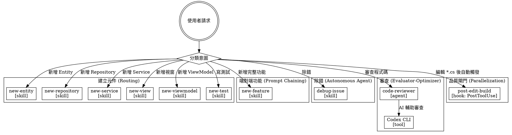

# Agent System Component Plan

**Date:** 2026-04-20
**Project:** Specurai (DatabaseDescriptionApp)
**Analysis source:** `.rcc/2026-04-20-analysis.md`

## Architecture Flowchart



## Workflow Pattern Mapping

| 工作流 | Anthropic 模式 | Entry Point |
|--------|--------------|-------------|
| 建立單一元件 | Routing | `/new-entity`, `/new-repo` 等 |
| 端對端功能 | Prompt Chaining | `/new-feature` |
| 除錯 | Autonomous Agent | `/debug-issue` |
| 程式碼審查 | Evaluator-Optimizer | 審查請求 |
| 品質閘門 | Parallelization（自動觸發） | PostToolUse hook |

## Dependency Graph

| 元件 | 依賴於 | 被依賴 | Phase |
|------|--------|--------|-------|
| CLAUDE.md 更新 | 無 | 所有元件 | 1 |
| settings.json hooks 區塊 | 現有 hooks JSON | 無 | 1 |
| rules/mvvm-patterns.md（加 paths:） | CLAUDE.md | new-view, new-viewmodel skills | 1 |
| rules/repository-pattern.md（加 paths:） | CLAUDE.md | new-repository skill | 1 |
| rules/cross-platform-scripts.md（精簡） | CLAUDE.md | hooks | 1 |
| 7 個技能 frontmatter 更新 | 無（獨立） | 無 | 1 |
| settings.local.json 清理 | 無 | 無 | 1 |

**所有元件在 Phase 1，可並行執行。**

## Component Plan

### Phase 1 — 全部並行（13 個修改，0 個新增）

#### C1 — settings.json：啟用 hooks 並加入 hooks 區塊
- **動作：** 修改
- **檔案：** `.claude/settings.json`
- **內容：** 加入 `"hooks"` 區塊，啟用 `post-edit-build` hook（PostToolUse on Edit/Write for **/*.cs）
- **修復弱點：** W2（hooks 全部停用）
- **執行工具：** 直接 Edit

```json
"hooks": {
  "PostToolUse": [
    {
      "matcher": "Edit|Write",
      "hooks": [
        {
          "type": "command",
          "command": "dotnet build --no-restore",
          "timeout": 60000
        }
      ]
    }
  ]
}
```

#### C2 — rules/mvvm-patterns.md：加 paths: 前置標頭
- **動作：** 修改
- **檔案：** `.claude/rules/mvvm-patterns.md`
- **內容：** frontmatter 加入 `paths: ["**/*.axaml", "**/*ViewModel.cs", "**/*View.axaml.cs", "**/*Window.axaml.cs"]`
- **修復弱點：** W1, W3, W4
- **執行工具：** writing-rules 或直接 Edit

#### C3 — rules/repository-pattern.md：加 paths: 前置標頭
- **動作：** 修改
- **檔案：** `.claude/rules/repository-pattern.md`
- **內容：** frontmatter 加入 `paths: ["**/*Repository.cs", "**/*Repository.Tests.cs", "**/Repositories/**"]`
- **修復弱點：** W1, W3, W4
- **執行工具：** writing-rules 或直接 Edit

#### C4 — rules/cross-platform-scripts.md：加 paths: + 精簡
- **動作：** 修改
- **檔案：** `.claude/rules/cross-platform-scripts.md`
- **內容：** frontmatter 加 `paths: ["**/*.sh", "**/*.ps1", ".github/workflows/**", "scripts/**"]`；移除可從 EditorConfig 推斷的換行符說明（節省行數至50行內）
- **修復弱點：** W1, W3, W4
- **執行工具：** 直接 Edit

#### C5–C11 — 7 個技能：更新 frontmatter description

| 元件 | 新 description |
|------|---------------|
| C5 new-entity.md | `建立新的 Domain Entity。Use when user says "新增 Entity", "建立實體", "new entity", "加一個 entity"。` |
| C6 new-repository.md | `建立新的 Repository（介面 + 實作）。Use when user says "新增 Repository", "建立 repo", "new repository", "加 repository"。` |
| C7 new-service.md | `建立新的 Application Service。Use when user says "新增 Service", "建立服務層", "new service", "加一個 service"。` |
| C8 new-view.md | `建立新的 Avalonia View（含配對 ViewModel）。Use when user says "新增視窗", "建立 View", "new window", "新增頁面"。不含 ViewModel 時請用 new-viewmodel。` |
| C9 new-viewmodel.md | `建立新的 ViewModel（不建立 View）。Use when user says "新增 ViewModel", "加 ViewModel" 且不需要新 View。需要配對 View 請用 new-view。` |
| C10 new-test.md | `建立新的單元測試。Use when user says "寫測試", "建立測試檔", "new test", "加測試案例"。` |
| C11 new-feature.md | `端對端建立完整功能（Entity → Repository → Service → ViewModel）。Use when user says "新增功能", "建立完整功能", "new feature", "端對端建立"。` |

- **修復弱點：** W5（C5–C11），W6（C8, C9）
- **執行工具：** 直接 Edit（frontmatter 只改 description 欄位）

#### C12 — CLAUDE.md：更新 Architecture 段落
- **動作：** 修改
- **檔案：** `CLAUDE.md`
- **內容：** 在 Architecture 表格加入 McpServer（MCP 工具伺服器）和 Cli（命令列工具）兩行
- **修復弱點：** W10
- **執行工具：** 直接 Edit

#### C13 — settings.local.json：移除 Windows 專用指令
- **動作：** 修改
- **檔案：** `.claude/settings.local.json`
- **內容：** 移除 `taskkill`、`dir`、`del`、`findstr`、`powershell -Command:*`、`timeout` 等 Windows 專用 Bash 指令（只保留跨平台和有效的指令）
- **修復弱點：** W9
- **執行工具：** 直接 Edit

### Known Deviation（不修復的弱點）

| 弱點 | 理由 |
|------|------|
| W8（`<law>` XML 標籤） | 已穩定運作，改為標準 Markdown 的收益低於成本；保留並記錄 |
| W7（技能缺 Routing 宣告） | 本專案技能為輕量工具型，無複雜鏈式呼叫，Routing section 對單步技能意義不大 |
| W11（部署說明） | Velopack 流程已在 push.md skill 和 release.yml 中記錄，不重複 |
| W12（結構化輸出） | 輕量技能不需報告格式，現有設計足夠 |
| W13（EditorConfig 鏡像） | cross-platform-scripts.md 已涵蓋核心規範 |

## Restructuring Summary

| 類型 | 數量 | HIGH | MEDIUM | LOW |
|------|------|------|--------|-----|
| 修改現有元件 | 13 | 3 | 9 | 1 |
| 新增元件 | 0 | — | — | — |
| 刪除元件 | 0 | — | — | — |
| Known Deviation | 5 | — | — | — |

## Execution Order

所有 13 個修改可並行，建議按以下順序執行以便驗證：

1. **C1** — settings.json hooks 區塊（最高影響，立即啟用品質閘門）
2. **C2–C4** — 3 個規則加 paths:（降低 session-start 行數）
3. **C5–C11** — 7 個技能更新 description（純 frontmatter 修改）
4. **C12** — CLAUDE.md Architecture 更新
5. **C13** — settings.local.json 清理

## Next Step

計劃確認後 → 啟動 `applying-agent-systems` 技能執行所有修改。
